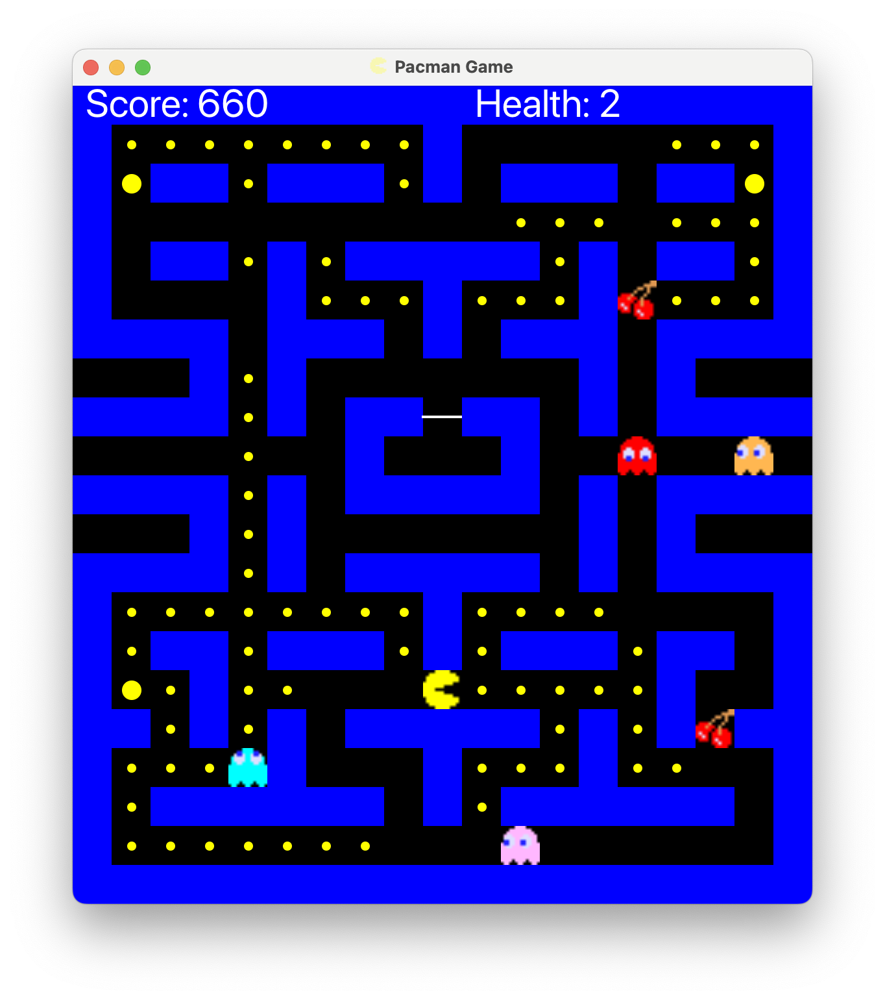

# Pac-Man Java Game



This project is a Java implementation of the classic Pac-Man game using JavaFX for the graphical interface. It's built with Maven for dependency management and project structure.

## Features

- Classic Pac-Man gameplay with unique power-ups
- JavaFX-based graphics
- 3 different game maps
- WASD controls for movement

## Requirements

- Java 17 or higher
- Maven (for dependency management and building)

All other dependencies will be handled by Maven.

## Installation

1. Clone the repository:
   ```
   git clone https://github.com/Sina-Hashemi/Pacman.git
   cd pacman
   ```

2. Build the project using Maven:
   ```
   mvn clean install
   ```

## Running the Game

You can run the game using Maven or by opening the project in an IDE like VSCode or IntelliJ IDEA.

### Using Maven

After building the project, run:

```
mvn clean javafx:run
```

### Using an IDE

1. Open the project in your preferred IDE (VSCode, IntelliJ IDEA, etc.)
2. Locate the main class file
3. Run the main class file using the IDE's run functionality

## How to Play

- Use WASD keys for movement:
  - W: Move Up
  - A: Move Left
  - S: Move Down
  - D: Move Right

- Navigate through the maze, eat all the dots, and avoid the ghosts to complete each level.
- Look out for special cherry power-ups that randomly appear on the map. These cherries can grant various temporary effects:
  - Speed Boost: Increases Pac-Man's movement speed
  - Ghost Freeze: Temporarily immobilizes all ghosts
  - Ghost Invisibility: Makes ghosts temporarily invisible

## Maps

The game features 3 different maps to add variety to your gameplay experience.

## Contributing

Contributions, suggestions, and feedback are welcome! Feel free to open an issue or submit a pull request.

## License

Distributed under the MIT License. See `LICENSE.txt` for more information.